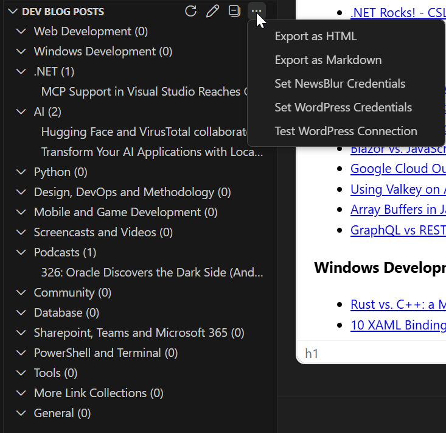
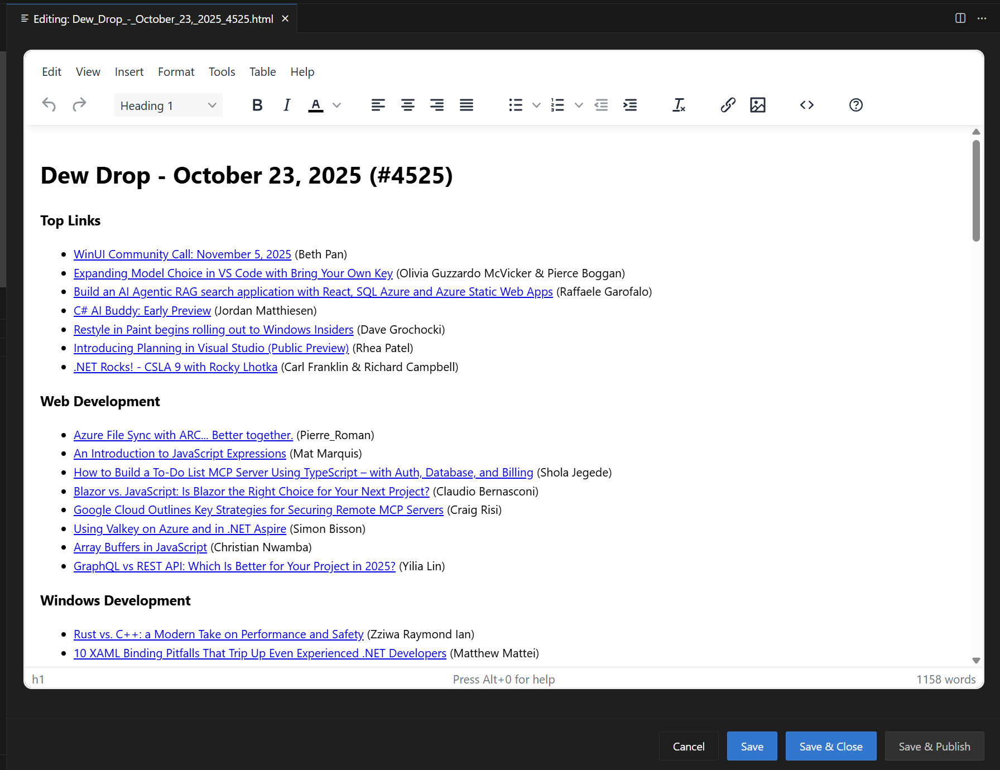

# Dev Feed Curator

Streamline your developer link blogging workflow. Fetch RSS feeds, auto-categorize posts by technology, and publish directly to WordPress—all from VS Code. Perfect for curating tech content like the "Dew Drop" series.

## Features

- **RSS Feed Parsing** - Fetches and parses RSS/Atom feeds with robust error handling
- **NewsBlur API Integration** - Optionally use NewsBlur API for authenticated access to get more than 25 items
- **Smart Categorization** - Automatically categorizes posts by technology (JavaScript, Python, DevOps, etc.)
- **Tree View Integration** - Displays categorized posts in VS Code sidebar with expandable categories
- **Export Functionality** - Generates HTML and Markdown files with professional templates
- **WordPress Publishing** - Direct publishing to WordPress blogs via REST API with secure credential storage and duplicate prevention
- **Automatic Tag Detection** - Intelligent extraction of technology tags from blog post content
- **Configurable Settings** - Customizable RSS feed URLs, refresh intervals, and date filtering
- **Optional Auto-refresh** - Configurable automatic feed updates (disabled by default for on-demand usage)
- **Book Recommendations** - Includes "The Geek Shelf" section with rotating book recommendations

## What's New in 3.0.0

- **New Brand Identity** - Rebranded to "Dev Feed Curator" with a modern, professional icon and clearer messaging
- **New Writing Category** - Added dedicated "Writing" category for content writing, blogging, grammar, and editing posts
- **Breaking Changes** - Command names updated to reflect new branding (see [release notes](release-notes/RELEASE_NOTES_3.0.0.md))
- **Updated Documentation** - Comprehensive documentation refresh throughout the project

## Screenshots

### Dev Blog Posts Panel

*The "Dev Blog Posts" view in the Explorer panel showing categorized blog posts with context menu options for exporting and managing feeds.*

### Visual Editor

*The built-in TinyMCE WYSIWYG editor for visually editing blog post content before publishing to WordPress.*

## Installation

### From VS Code Marketplace

1. Open VS Code
1. Go to Extensions view (`Ctrl+Shift+X`)
1. Search for "Dev Feed Curator"
1. Click Install

### From VSIX Package

1. Download the `.vsix` file from the [releases](https://github.com/alvinashcraft/RssBlogCategorizer/releases)
1. Open VS Code
1. Go to Extensions view (`Ctrl+Shift+X`)
1. Click the three dots menu and select "Install from VSIX..."
1. Select the downloaded `.vsix` file

## Usage

### Getting Started

1. After installation, the "Dev Blog Posts" view will appear in the Explorer panel sidebar
1. The extension comes pre-configured with a default RSS feed
1. **Click the refresh button** in the view header to load posts (no automatic refresh on startup)
1. Posts are automatically categorized and displayed in a tree structure
1. **Optional**: Enable auto-refresh in settings if you want automatic updates

### Setting Up Your RSS Feed

**Via Explorer Panel:**

1. Click the edit icon (pencil) in the "Dev Blog Posts" view header
1. Enter your RSS feed URL when prompted

**Via Command Palette:**

1. Open Command Palette (`Ctrl+Shift+P`)
1. Run "Dev Feed Curator: Set RSS Feed"
1. Enter your RSS feed URL when prompted

Click the refresh button to load new content after updating the feed URL.

### Manual vs Automatic Refresh

By default, the extension uses **manual refresh** for better performance and control:

- **Manual Mode** (default): Click the refresh button when you want to check for new posts
- **Automatic Mode** (optional): Enable "Auto Refresh" in settings for periodic updates

Manual refresh is recommended for most users as it prevents unnecessary network requests and provides better control over when data is updated.

### NewsBlur API Integration (Optional)

For enhanced functionality, you can configure NewsBlur API access to retrieve more than 25 items:

1. **Enable NewsBlur API**: Set `rssBlogCategorizer.useNewsblurApi` to `true` in settings
1. **Set Username**: Configure your NewsBlur username in `rssBlogCategorizer.newsblurUsername`
1. **Set Credentials**: Use Command Palette → "Dev Feed Curator: Set NewsBlur Credentials" to securely store your password

**Benefits of NewsBlur API:**

- Access more than 25 feed items (RSS feeds are typically limited to 25)
- More reliable access to popular feeds
- Better handling of feed redirects and updates
- Date filtering based on when you shared items in NewsBlur (shared_date) rather than original publication date

### Exporting Posts

**Via Explorer Panel:**

1. Click "Export as Markdown" or "Export as HTML" from the "Dev Blog Posts" view menu

**Via Command Palette:**

1. Open Command Palette (`Ctrl+Shift+P`)
1. Run "Dev Feed Curator: Export as Markdown" or "Dev Feed Curator: Export as HTML"

**Export Process:**

1. Choose your save location (filename is auto-generated from the blog post title)
1. The exported file will include:
   - Auto-generated "Dew Drop" title with incremental numbering
   - Categorized posts with author attribution
   - "The Geek Shelf" section with book recommendations

**Default Filename**: Files are automatically named using the blog post title, for example:

- `Dew_Drop_October_11_2025_4517.html`
- `Dew_Drop_October_11_2025_4517.md`

### WYSIWYG Editor

The extension provides built-in WYSIWYG editors for both HTML and Markdown files:

#### HTML Editor (TinyMCE)

After exporting to HTML, you can optionally edit your blog post content using the built-in WYSIWYG editor:

**Opening the Editor:**

- **From Export**: After HTML export, click "Open in Editor" when prompted
- **From HTML File**: Open any HTML file and click the edit icon (📝) in the toolbar
- **Command Palette**: Use "Dev Feed Curator: Open HTML in WYSIWYG Editor"

**Editor Features:**

- **Rich Text Editing**: Full WYSIWYG editing with TinyMCE
- **Formatting Tools**: Bold, italic, colors, alignment, lists, links, images
- **Keyboard Shortcuts**: Ctrl+S (Cmd+S on Mac) to save
- **VS Code Integration**: Respects your VS Code theme and settings

**Note on Spellcheck**: Advanced spellcheck features (red underlines, suggestions) are not currently available as TinyMCE removed the free spellcheck plugin in version 6.0. The editor relies on your browser's native spellcheck functionality. Enhanced spellcheck is not on the roadmap due to this limitation.

#### Markdown Editor (EasyMDE)

For Markdown files, the extension provides a dual-mode editor with both text-based and WYSIWYG editing:

**Opening the Editor:**

- **From Markdown File**: Open any `.md` or `.markdown` file and click the edit icon (📝) in the toolbar
- **Command Palette**: Use "Dev Feed Curator: Open Markdown in WYSIWYG Editor"

**Editor Features:**

- **Dual Editing Modes**: Switch between direct Markdown editing and WYSIWYG
- **EasyMDE Integration**: Professional-grade Markdown editor with live preview and dark mode support
- **Rich Formatting**: Supports tables, code blocks, lists, links, and more
- **Keyboard Shortcuts**: Ctrl+S (Cmd+S on Mac) to save
- **Theme Consistency**: Inherits VS Code theme colors

**Workflow:**

1. Open the editor for your HTML or Markdown file
1. Edit your content visually in the WYSIWYG editor (for Markdown, EasyMDE provides live preview side-by-side)
1. Click "Save" to update the file
1. Click "Save & Publish" to save and proceed to WordPress publishing
1. Click "Cancel" to close without saving (with confirmation if changes exist)

### Publishing to WordPress

After exporting to HTML, you can publish directly to your WordPress blog:

**Prerequisites:**

1. **Configure WordPress Settings**: Set your blog URL and username in settings
1. **Set Credentials**: Use Command Palette → "Dev Feed Curator: Set WordPress Credentials" to securely store your login

**Publishing Process:**

1. **Export to HTML** first using the export functionality above
1. **Open the HTML file** in VS Code editor
1. **Click the WordPress publish button** in the editor toolbar (cloud upload icon)
   - Or use Command Palette → "Dev Feed Curator: Publish to WordPress"
   - Only the content inside `<body>` tags is published (excludes `<html>`, `<head>`, etc.)
1. **Choose categories**: Use default categories (configurable in settings), customize for this post, or publish without categories
1. **Review auto-detected tags**: The extension automatically detects technology tags from content - use detected tags, customize them, or skip
1. **Choose publish status**: Publish immediately or save as draft
1. **Confirmation**: The extension will confirm successful publication with the post ID, assigned categories, and tag count

**Publication Tracking:**

Starting with version 2.2.0, the extension automatically tracks publication status to prevent duplicates:

- **Metadata Embedding**: All exported HTML and Markdown files include publication metadata comments
- **Duplicate Detection**: When publishing, the extension checks if content has already been published to WordPress
- **Automatic Updates**: After successful publishing, the file metadata is updated with the WordPress post ID and publication date
- **User Confirmation**: If duplicate publication is detected, you'll be prompted to confirm before proceeding

For more details, see [Publication Tracking Documentation](docs/PUBLICATION_TRACKING.md).

**WordPress Setup Requirements:**

- WordPress site with REST API enabled (enabled by default in WordPress 4.7+)
- WordPress user account with publishing permissions
- Application Password for secure authentication (recommended for WordPress 5.6+)

**Automatic Tag Detection:**

The extension automatically analyzes your blog post content and detects relevant technology tags including:

- **Frameworks & Platforms**: .NET, ASP.NET Core, Blazor, React, Node.js, Uno Platform
- **Programming Languages**: C#, JavaScript, TypeScript, Python, Go, Swift, Kotlin
- **Cloud & DevOps**: Azure, AWS, Docker, Kubernetes, TeamCity
- **AI & ML**: ChatGPT, Copilot, Claude, Gemini, Perplexity
- **Mobile & IoT**: Android, iOS, Raspberry Pi
- **Databases**: SQL Server, MySQL, PostgreSQL
- **Tools**: Visual Studio, VS Code, Android Studio, Playwright
- **And 50+ more technology keywords**

The system intelligently matches content against a comprehensive technology keyword database and presents detected tags for your review before publishing.

**Security Notes:**

- WordPress credentials are stored securely using VS Code's built-in SecretStorage
- Passwords are never stored in plain text or configuration files
- Use WordPress Application Passwords for enhanced security when available

## Configuration

Access settings via `File > Preferences > Settings` and search for "Dev Feed Curator":

- **Feed URL**: Single RSS feed URL to monitor
- **Record Count**: Number of records to retrieve (10-500)
- **Minimum DateTime**: Filter posts by publication date (UTC format)
- **Enable Auto Refresh**: Turn on automatic feed updates (disabled by default)
- **Refresh Interval**: Auto-refresh interval in minutes (when auto-refresh is enabled)
- **Use NewsBlur API**: Enable NewsBlur API integration for enhanced functionality
- **NewsBlur Username**: Your NewsBlur account username (password stored securely)
- **WordPress Blog URL**: Your WordPress blog URL (e.g., `https://yourblog.com`)
- **WordPress Username**: Your WordPress account username (password stored securely)
- **WordPress Categories**: Default categories to assign to published posts (e.g., "Daily Links", "Development")
- **Open Links in New Tab**: Control whether exported links open in a new browser tab (disabled by default)
- **Enable Post Filtering Buffer**: Enable buffer time when filtering posts by date (enabled by default)
- **Post Filtering Buffer Minutes**: Number of minutes to add as buffer when filtering posts (default: 5 minutes, range: 0-60)

**Note**: Tags are automatically detected from content and don't require configuration - the system analyzes your blog post and suggests relevant technology tags during publishing.

### Smart Date Filtering

The extension uses intelligent date filtering to ensure you get the most relevant recent posts:

- **Automatic Mode** (default): Uses the publication date of the latest "Dew Drop" post from alvinashcraft.com
- **Fallback**: If unavailable, filters to posts from the last 24 hours (UTC)
- **Manual Override**: Set a custom UTC datetime in settings
- **Buffer Time**: Optional configurable buffer (default 5 minutes) added to avoid edge cases with timing differences

**Date Filtering Logic:**

- **Minimum**: Posts newer than the last Dew Drop date (plus optional buffer)
- **Future Posts**: All future-dated posts are now included (no future date filtering)
- **Purpose**: Captures shared stories and posts with proper timezone handling

Example UTC formats:

- `2025-01-01T00:00:00Z` (midnight UTC)
- `2025-09-27T12:00:00.000Z` (with milliseconds)

## Category Customization

You can customize how posts are categorized by editing the `categories.json` file in your extension directory. Posts are automatically sorted into categories based on keywords in their titles.

See [CATEGORIES.md](docs/CATEGORIES.md) for detailed configuration instructions.

## Available Commands

| Command | Description |
|---------|-------------|
| `Dev Feed Curator: Refresh` | Refresh the RSS feed |
| `Dev Feed Curator: Export as Markdown` | Export posts to Markdown |
| `Dev Feed Curator: Export as HTML` | Export posts to HTML |
| `Dev Feed Curator: Set RSS Feed` | Configure RSS feed URL |
| `Dev Feed Curator: Set NewsBlur Credentials` | Securely configure NewsBlur API credentials |
| `Dev Feed Curator: Set WordPress Credentials` | Securely configure WordPress publishing credentials |
| `Dev Feed Curator: Publish to WordPress` | Publish HTML file to WordPress blog |
| `Dev Feed Curator: Open HTML in WYSIWYG Editor` | Open HTML file in TinyMCE WYSIWYG editor |
| `Dev Feed Curator: Open Markdown in WYSIWYG Editor` | Open Markdown file in EasyMDE-based WYSIWYG editor |

All commands are accessible through the Command Palette (`Ctrl+Shift+P`) or the extension's tree view interface.

## Documentation

- **[Publication Tracking](docs/PUBLICATION_TRACKING.md)** - Detailed guide to publication metadata and duplicate prevention
- **[WYSIWYG Markdown Editor](docs/dev/WYSIWYG_MARKDOWN_EDITOR.md)** - Technical implementation details of the EasyMDE-based Markdown editor
- **[Development Roadmap](docs/ROADMAP.md)** - Planned features and upcoming enhancements
- **[Development Guide](docs/dev/DEVELOPMENT.md)** - Development setup, building, and contribution information

## Development

Interested in contributing or building from source? See [DEVELOPMENT.md](docs/DEVELOPMENT.md) for detailed development setup, building instructions, testing guidelines, and contribution information.

## License

This project is licensed under the MIT License - see the [LICENSE](LICENSE) file for details.

## Author

### Alvin Ashcraft

- Website: [alvinashcraft.com](https://www.alvinashcraft.com)
- GitHub: [@alvinashcraft](https://github.com/alvinashcraft)

---

*Built for the developer community to streamline blog content curation and designed to work seamlessly with the "Dew Drop" series workflow.*
